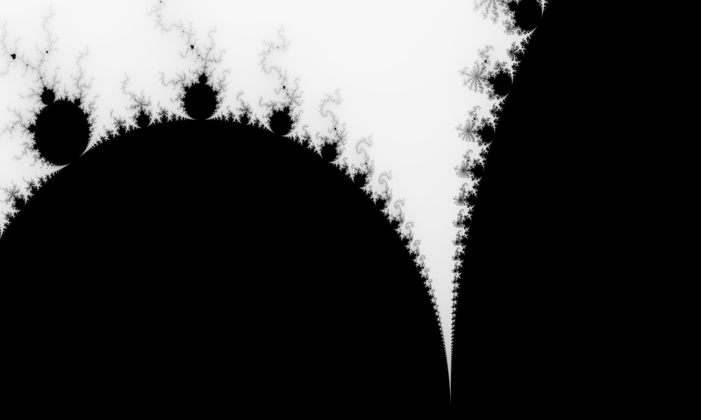

# Parallel Mandelbrot Plotter

A high-performance command-line tool written in Rust that generates Mandelbrot set fractals. The program utilizes multi-threading to divide the plotting workload into 8 bands, ensuring efficient CPU usage and faster image generation.



## Usage

Build the project in release mode for optimal performance:

```fish
cargo build --release
```

Run the program by specifying the output file, image dimensions, and the complex plane coordinates (upper-left and lower-right).
Example:

```fish
target/release/mandelbrot output.png 4000x3000 -1.20,0.35 -1,0.20
```

or simply:

```fish
cargo run output.png 4000x3000 -1.20,0.35 -1,0.20
```

## Implementation

- **Language:** Rust
- **Dependencies:** `num-complex` for math, `image` for image output and `crossbeam` for concurrency.
- **Concurrency:** Implements manual work-stealing logic by splitting the image buffer into discrete, thread-safe segments.

---

<p>&nbsp</p>

_This project was developed as a learning exercise following the book "Programming Rust" by Blandy, Orendorff, and Tindall._
